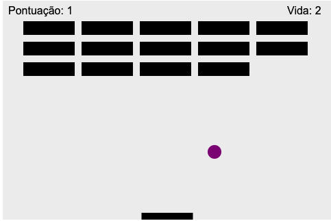

# Breakout Game

Breakout Game its game for arcade, old and classic !
Game made with Javascript and Canvas !

GAME LINK: https://samueloh99.github.io/BreakoutGame/

# Sceenshot

<div>
    
</div>

## Installation

If you’d like to view my project in your browser:

```
$ git clone https://github.com/samueloh99/BreakoutGame.git

```

And then right click on the `index.html` file and open it in your browser.

## Instructions to play:

- Move your arrow keys
- Or move your mouse (right or left)

## Possible future features:

- More levels
- Faster ball colision

## If you want to contribute

1. Fork it
2. Create your branch ($ git checkout -b feature/fooBar)
3. Commit your changes ($ git commit -am 'Add some fooBar')
4. Push to the branc ($ git push origin feature/fooBar)
5. Create a new pull Request
